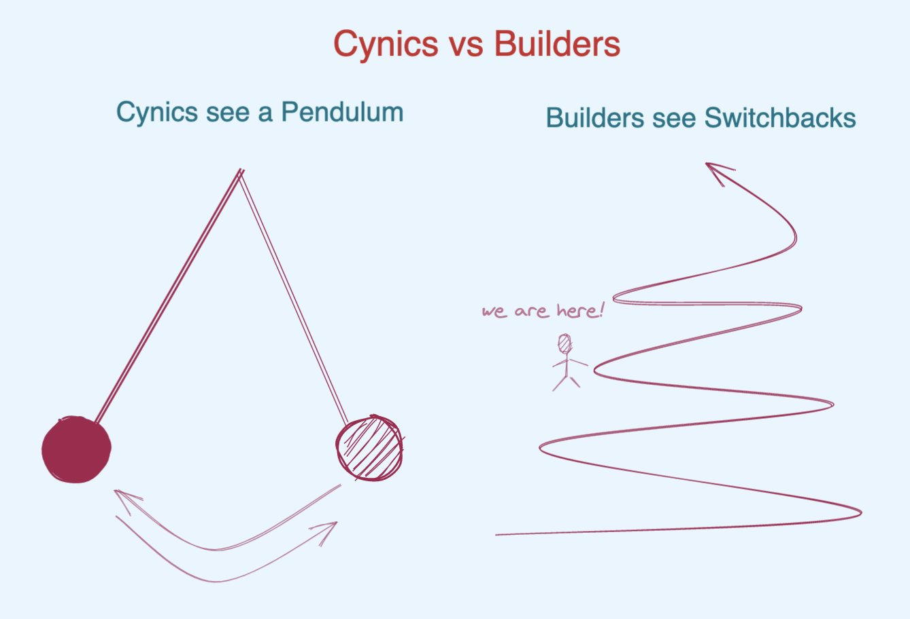

# FE개발자로서 못해준 이야기

[FE개발자로서 못해준 이야기 1 - 프로젝트](https://partnerjun.tistory.com/82)글에 대한 김혜성(당근마켓)님의 트윗 쓰레드를 옮김.

## 트윗 쓰레드

```txt
1. 아님. 점수가 20점 내외로 나오는 것은 정말 심각한게 맞긴한데.. 보통 한계는 FID를 개선 못한것에서 옴 (Lighthouse 지표 중 가장 계수가 큼)

Netflix 프론트 페이지는 리액트 쓰지만 스크립트를 죄다 컴파일해서 극복했다고 알린게 벌써 7년전 얘기임.
```

```txt
그리고 페이지 인덱스에 기여하는 성능 지표도 이제 상당히 복합적이기 때문에 첫페이지서 경쟁하는데 프레임워크 하나로 사이트 망하네 뭐네 얘기하기 어려움. LightHouse 하나가 실제 사이트 성능을 대변하지 않음
```

```txt
PageSpeed Index 보면 LightHouse와 같은 지표를 공유하지만 실제 사용자 환경 차이로 인해서 로컬에서 돌리는 것과 상당한 차이를 보여줌. 심지어 이제 이거 말고 Web Vitals 같은 기타 신호가 더 들어감.

그리고 검색 노출 기여도에는 이 모든 것보다 사이트 구조가 훨씬 우선됨
```

> 해당 내용 page speed는 `https://pagespeed.web.dev/` 이다.

```txt
2. 대체로 동의
```

```txt
3. 대체로 동의하는데 비교가 좀 이상함.

Next 서버 레이어는 API 역할을 대체하기 위해 있는게 아님.

Vite는 의도적으로 Rollup 호환으로 설계된 물건이라 다른 번들러에 비해 Capabilities가 떨어지지 않음. 글에 언급된건 전부 번들러 외부의 커스터마이징 영역
```

```txt
4. 웹 클라에서 Node.js API가 익숙하기 때문에 명칭의 혼동이 있다는건 너무 비약이다. 그렇다고 하더라도 네임스페이싱이라는 도구를 활용한다.
```

```txt
5. 본문의 설명대로 why나 how에 대한 주석은 즐겨쓴다만, 예시로 든 스크린샷 처럼 그냥 what에 대한 기계적인 주석은 솔직히 없는게 낫다
```

```txt
6. 상태머신은 주로 게임업계에서나 쓴다...? 이건 진짜 뭔소린지... 그 유명한 Elm architecture를 요약하면 당신의 웹 프론트엔드 애플리케이션은 그냥 상태머신이다.
```

```txt
상태머신이 패턴이고 유지보수성 때문에 선택했다는 것도 그냥 예시가 잘못됐음.

앱이 상태머신으로 표현되는건 거의 현상에 가깝고 명시적으로 다루는 경우 변경 코스트가 가파른건 굉장히 잘 알려져 있음
```

```txt
6. 타입스크립트 어쩌고

https://lexi-lambda.github.io/blog/2020/01/19/no-dynamic-type-systems-are-not-inherently-more-open/
```

```txt
시리즈 두번째 글은 좋다. 컨텐츠 모델링 같이 하는건 나도 맨날 하는 얘기고 몇번을 강조해도 모자르지 않다. (그만큼 잘 안된다) 실제 변경 시 재사용성에 기여도를 분석해본다면 코드 아키텍쳐 따위보다 훨씬 높게 과반수 이상을 차지할 것이다. 이건 내기해도 좋음
```

```txt
다만 요새 Server Driven UI 가 은총알인 마냥 여기저기서 언급되는데, 첫번째 글에서 UX 다룬거 치고 이 패턴 때문에 UX 악화되는건 언급이 안된다.

Server Driven UI는 의존성 데이터 패칭을 위한 대기를 심화시키기 때문에 UX에 졸라 나쁘다. 데이터 의존성을 전부 정적으로 가져올 수 있어야함
```

```txt
언더패칭도 오버패칭도 허용하지 않고 정확한 의존성만 배치하려면 프로그래밍 모델을 바꿔야 함. 결코 쉬운게 아님. 앞글에 나온 복잡성 어쩌고를 다 떠안아야 할까말까 한 일이기 때문에 논지와 내용이 좀 모순되어 보임
```

```txt
결국 모든 내용을 알고보면 다 트레이드오프이고 한바퀴 돌아 적절한걸 선택하자는 내용으로 보인다. 하지만 어떤 엔지니어들은 한계를 인정하지 않고 부딪혀서 확장하기에 진화한다.
```

